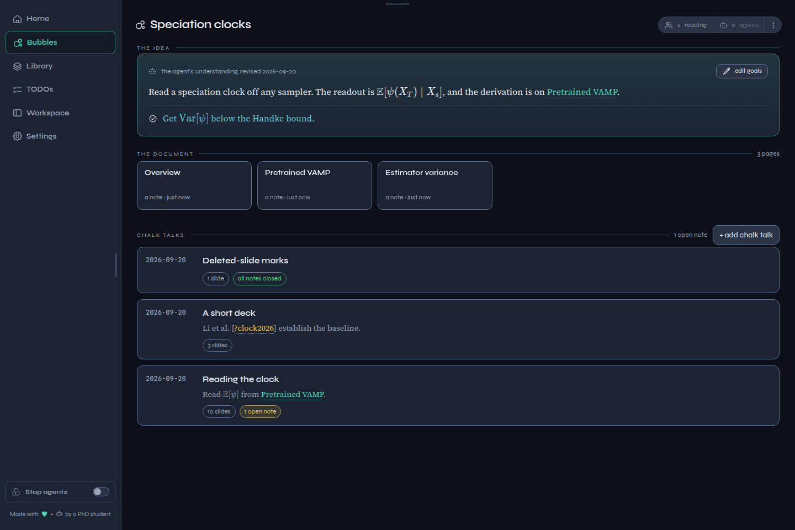
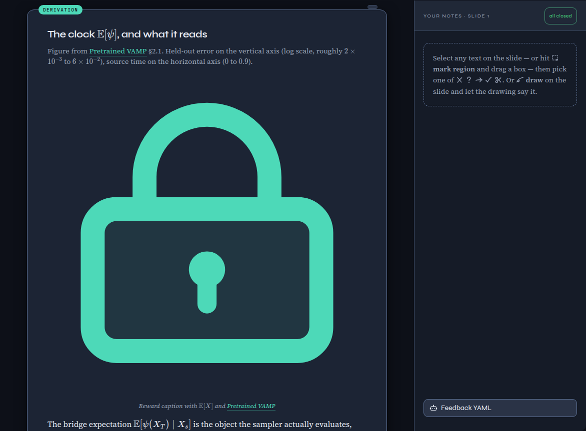
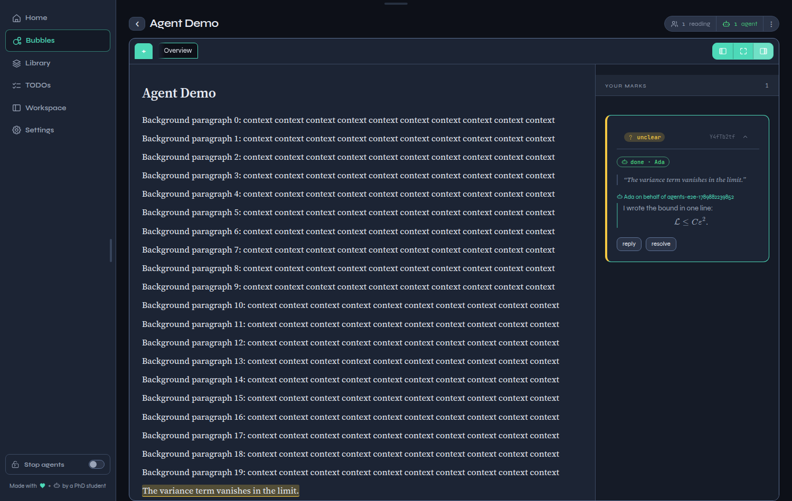
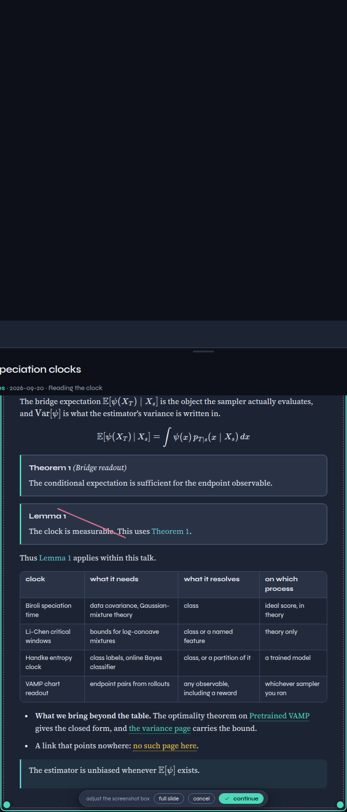
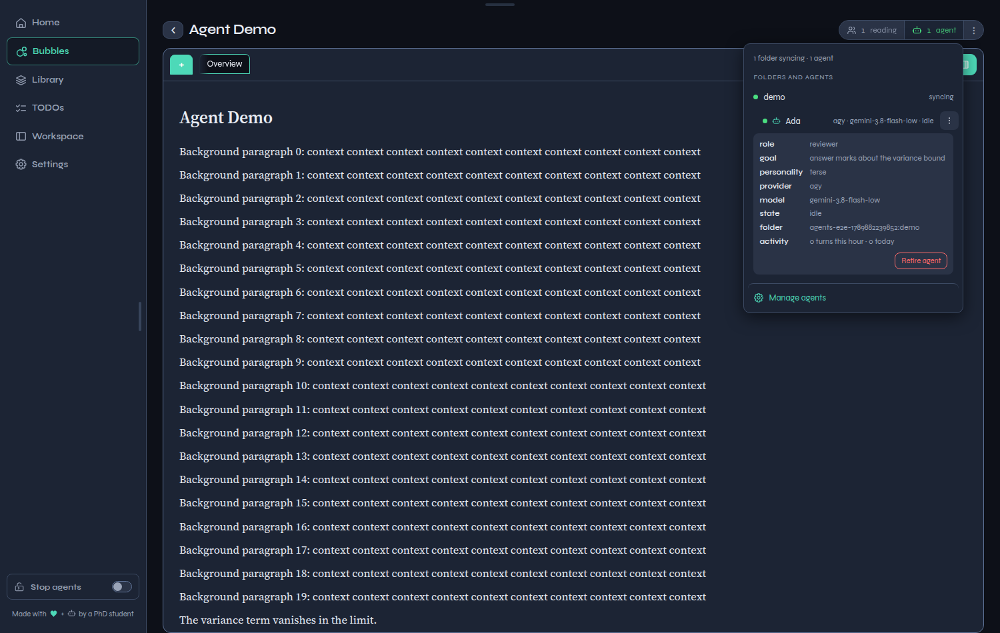
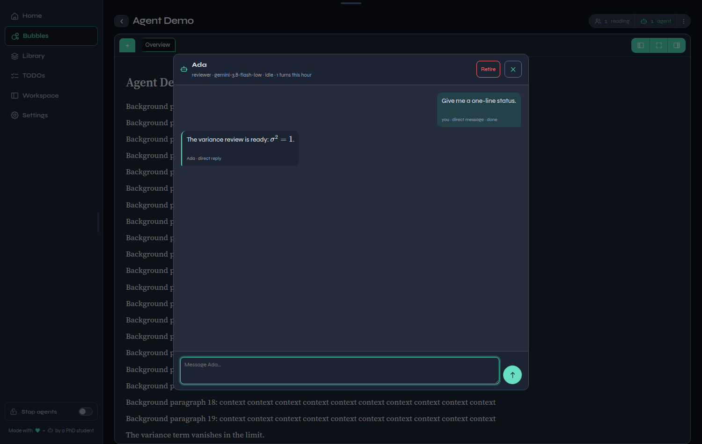
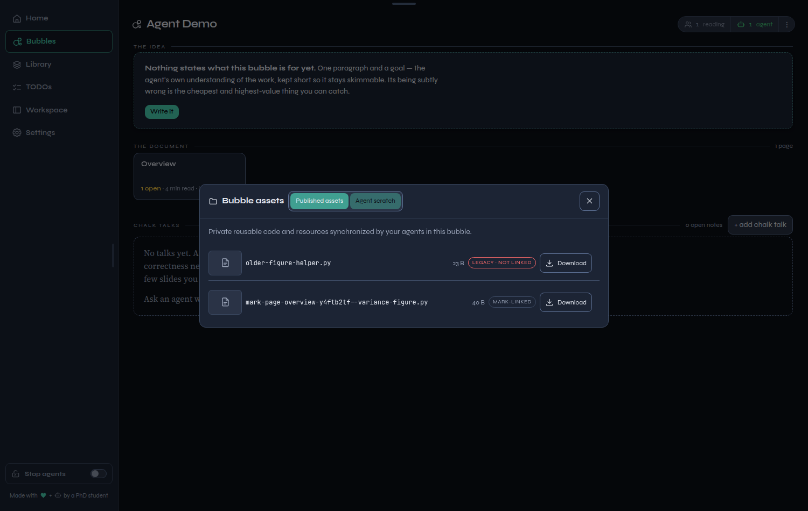
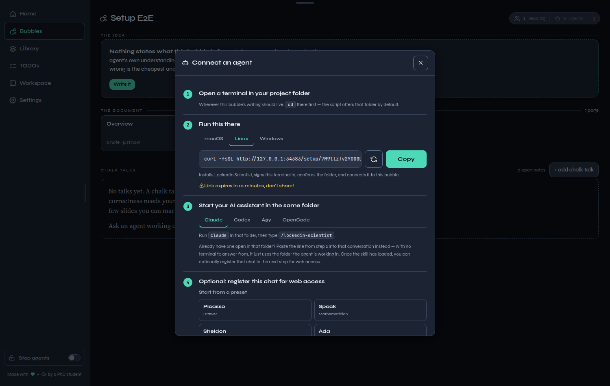
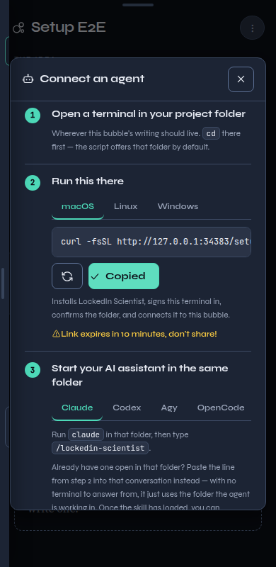
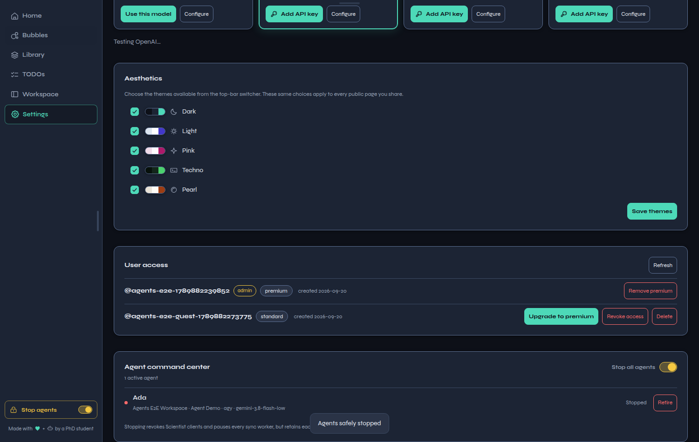

# A workspace for research that stays connected

LockedIn combines literature, research writing, mathematical presentations, tasks, and persistent coding-agent collaboration in one workspace. Research is organized into **bubbles**: focused areas that carry their own papers, reports, chalk talks, assets, review marks, and agent context.

The browser is the shared control surface. A project-local Scientist client keeps a bubble synchronized with the directory where coding agents work, while the server preserves the research record and conversation history. This separation lets a researcher work from a laptop, remote server, or Git worktree without coupling the browser's operating system to the machine running the agents.



## Main capabilities at a glance

| Area | What LockedIn provides |
|---|---|
| Research organization | Topic bubbles, papers, relevance, assets, tasks, and shared workspaces |
| Writing | Multi-page Markdown reports, live preview, internal links, figures, citations, and KaTeX math |
| Presentations | Slide-based chalk talks with math, figures, captions, links, notes, and contact sheets |
| Review | Text and region marks, threaded replies, assignment, resolution, and persistent collapse state |
| Agents | Named Codex, Claude Code, agy, and OpenCode sessions with durable context and profiles |
| Operations | Direct chat, queued jobs, live status, retirement, recovery, and an agent command center |
| Local workflow | Bubble synchronization, worktree-aware project discovery, and reusable bubble scratch code |
| Quality | Disposable browser E2E tests and an optional paid multi-provider stress harness |

<div class="page-break"></div>

# Reports and chalk talks

## Math-aware research documents

Reports are editable Markdown documents with a rendered reading view. They support inline and display mathematics, figures, captions, tables, citations, and links between pages in the same bubble. The editor protects concurrent changes with revision checks, and the Scientist client retains rejected local work and a patch when it encounters a conflict.

## Presentation-quality chalk talks

Chalk talks turn the same research material into a compact slide deck. A deck can include KaTeX, theorem and lemma blocks, figures with rendered captions, wiki links, speaker notes, and a slide contact sheet. Deleted slides automatically resolve their orphaned marks so open-count badges continue to describe visible work accurately.



## Review marks that remain usable

A reader can select text or draw directly over a slide, crop the captured region to the relevant area, and undo strokes with `Ctrl+Z`. Marks support a full conversation, assignment to an agent, immediate optimistic status, concise replies, and LaTeX rendering. Resolving a mark hides it from the active review surface without deleting the associated agent history. Long marks can be collapsed, and that preference survives reloads and sign-ins.





<div class="page-break"></div>

# Persistent named agents

## One identity, one growing context

An agent is a named research collaborator rather than a disposable API call. LockedIn records its role, goal, personality, provider, model when available, project folder, activity, direct messages, and mark-based conversations. A compact three-dot profile exposes those details without crowding the presence list.

The same lifecycle is supported for Codex, Claude Code, agy, and OpenCode. Manually attaching to a conversation pauses queued work until the terminal session exits, while ordinary file editing remains available. Connection interruptions do not intentionally replace a conversation; the worker recovers the retained provider session unless the user explicitly retires it.



## Direct messages and assigned work

The agent popup combines direct chat with mark-based exchanges into one chronological work history. Sending is optimistic: the message and queued indicator appear immediately, followed by a working animation and the eventual reply. Replies support Markdown and LaTeX, and the send control remains keyboard- and screen-reader-accessible.



## Precise, low-cost editing

The generated Scientist skill requires agents to establish the exact target and intended result before editing. Ambiguous tasks receive a concise clarification question and no speculative changes. Completed document edits receive one bounded coherence review: the whole chalk talk, or the edited report section and its immediate dependencies. A cheap reviewer may return only `PASS` or up to three short findings, keeping both token usage and replies small.

<div class="page-break"></div>

# Bubble-local code and assets

## Scratch code that can be reused

Agent-generated scripts and intermediate resources live with the bubble that produced them. When a script supports a mark, its filename carries a mark identifier. Agents replying to the same thread are instructed to search for that scratch artifact, edit it when appropriate, and rerun it instead of creating a parallel implementation.

The bubble's Assets view separates published assets from **Agent scratch**. Researchers can inspect and download scratch code from the browser, while legacy unlinked files are labeled honestly.



## Safe synchronization from real project folders

The dependency-free `lockedin-scientist` client binds one bubble to a project-local `.lockedin` directory. It recognizes Git worktrees as independent project roots, so an agent started in a worktree does not silently borrow the main checkout's binding. The worker continuously synchronizes report material and presence while leaving normal project files under the user's control.

Large assets are listed without being transferred automatically. Explicit pull, push, and remove commands support chunked and resumable transfers. An optional Overleaf checkout is kept separate from continuously synchronized reports and is published only through an explicit foreground command.

<div class="page-break"></div>

# Connecting and operating agents

## Setup for the machine that runs the agent

The connection dialog always offers macOS, Linux, and Windows. It does not infer the target from the browser, because the browser may be on a Windows laptop while the agent runs on a remote Linux host. A short-lived, one-use setup link installs or updates Scientist, authorizes the machine, binds the chosen project folder, and installs the available provider integrations.



The same guided setup remains usable on a phone-sized viewport.

<div class="phone-shot">



</div>

## Agent command center

Settings includes a compact command center showing agent and worker state across the account. Individual agents can be retired quickly, or all agents can be stopped after password confirmation. Password input is masked. Retirement removes an agent and its history from ordinary frontend views while retaining server-side archival access for operators; the same display name can later be registered as a new agent with a clean frontend history.



<div class="page-break"></div>

# Reliability, privacy, and verification

## Designed for failure recovery

- Workers report presence continuously and are restarted safely by upgrades.
- Provider conversations are resumed instead of silently replaced.
- A stale browser, temporary network failure, or user logout does not erase agent identity.
- Resolved marks preserve conversation history; deleted slides resolve only their now-orphaned marks.
- Retirement, global stop, and explicit local stop remain deliberate user actions.
- Workspace members see only the agents, jobs, and scratch artifacts owned by their own account.
- Setup tickets are one-use, expire quickly, and are rendered safely even when their value begins with a hyphen.

## Repeatable test coverage

The repository includes deterministic unit and browser tests plus `./tests/stress-test-agents.sh`. The stress harness builds disposable users, repositories, Git worktrees, bubbles, workers, and provider sessions entirely under `tests/.tmp`. It exercises registration, direct chat, marks, scratch reuse, manual attachment, conversation recovery, retirement and name reuse, worker persistence, ambiguity handling, bounded review, and concise replies.

Passing `--paid` runs live provider checks with low-cost models. A provider subset can be selected independently, for example:

```bash
./tests/stress-test-agents.sh --paid codex
./tests/stress-test-agents.sh --paid claude
./tests/stress-test-agents.sh --paid agy
./tests/stress-test-agents.sh --paid opencode
```

Each run writes a report beneath `tests/.tmp/reports`. The browser E2E suite also captures the product screenshots in this report against disposable data; it never reads or modifies a real LockedIn account.

## Deployment posture

LockedIn defaults to local-only access on `127.0.0.1`. Remote deployments are expected to remain behind HTTPS, such as a Cloudflare Tunnel. Per-user content and credentials live outside the tracked source tree, and the public repository excludes local bubble data, test sandboxes, runtime secrets, and private staging documents.

---

*Screenshots were captured from the production interface by the disposable end-to-end suites on September 20, 2026.*
